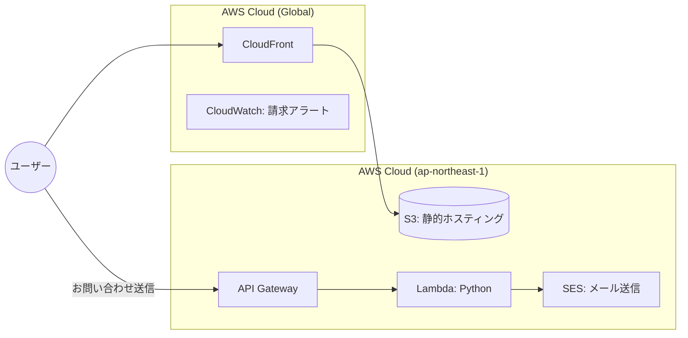

# サーバーレス・ポートフォリオサイト

AWSのサーバーレスアーキテクチャを活用した、フルスタックなポートフォリオサイトです。
フロントエンドの配信からバックエンドのメール送信機能まで、すべてスケーラブルかつ低コストな構成で構築しています。

## 使用技術のバージョン
- React, TypeScript, AWSサービス


## 🏗 システム構成図



## ✨ プロジェクトのポイント
- 完全サーバーレス:

  S3 + CloudFront + Lambda を採用。アクセスがない時はコストがほぼゼロになるよう設計。

- セキュリティの担保:
  
  日本国外からのアクセスを制限。不要な海外トラフィックや攻撃を遮断。

  CloudFront による HTTPS 通信の強制。

- バックエンドの実装:

  Python (Lambda) を使用し、API Gateway 経由でフロントエンドとお問い合わせ機能を連携。

  Amazon SES を用いたメール通知システムを構築。

- コスト・リスク管理:

  CloudWatch で請求額を監視。5ドル以上の課金が発生した際に自動でメール通知するアラートを設定。

## 🚀技術スタック
Frontend: React (Vite), TypeScript

Infrastructure: AWS (S3, CloudFront, WAF, API Gateway, Lambda, SES, CloudWatch)

Language: Python (Backend)

## 🔧環境設定
`.env.local` ファイルに以下のようにAPIのエンドポイントURLを設定してください。
```
API_ENDPOINT_URL=your_api_endpoint_url
```

# ライブラリのインストール
npm install

# ローカル開発サーバーの起動
npm run dev

※ お問い合わせ機能の動作には、.env.local に API のエンドポイント URL を設定する必要があります。
